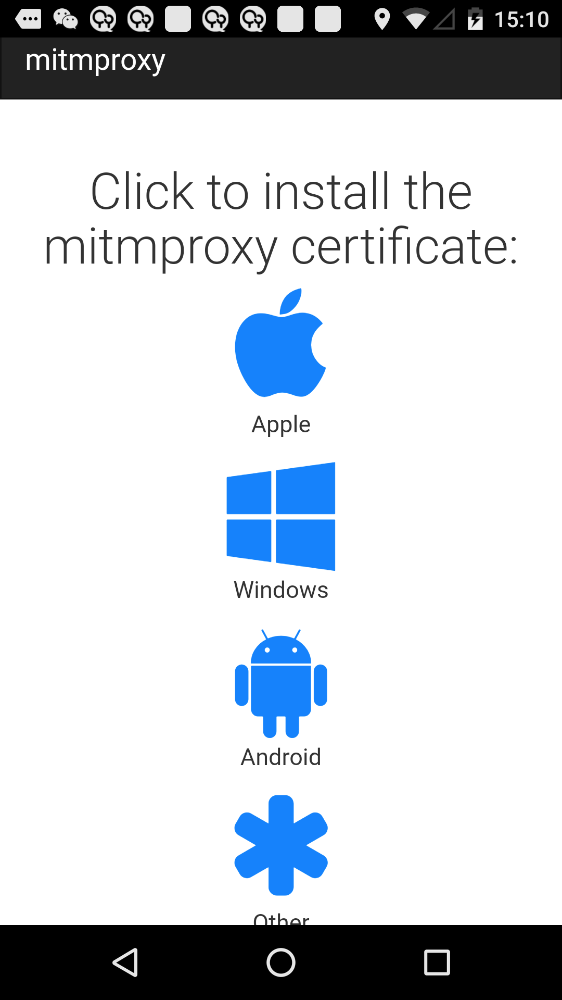
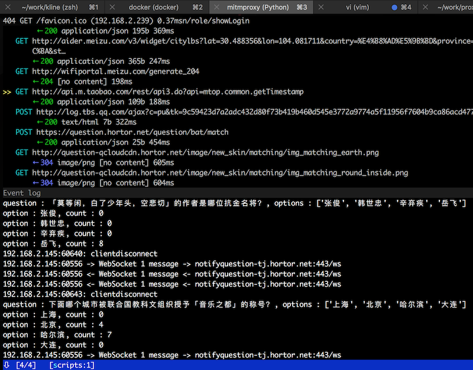

# hortor_cheater

> 王者头脑作弊辅助工具

基于 [mitmproxy](https://github.com/mitmproxy/mitmproxy) 实现, 具体方式是抓包获取数据问题和选项, 通过搜索引擎查询问题, 
并在返回页面中匹配问题选项出现的次数, 一般来说出现次数最多的选型可能是正确答案的概率较大 (或者出现次数最少的选项).

运行程序:

```bash
$ mitmproxy -p 8129  -s listen.py
```

打开 `http://mitm.it` 下载并安装证书, 并设置设备的手动代理到相应地址(eg. 192.168.2.235:8129)



选项在搜索结果中出现的次数, 会显示在选项最后


或者, 输入 "e" 查看日志可以提前看到答案



然后, 就可以轻松王者啦


